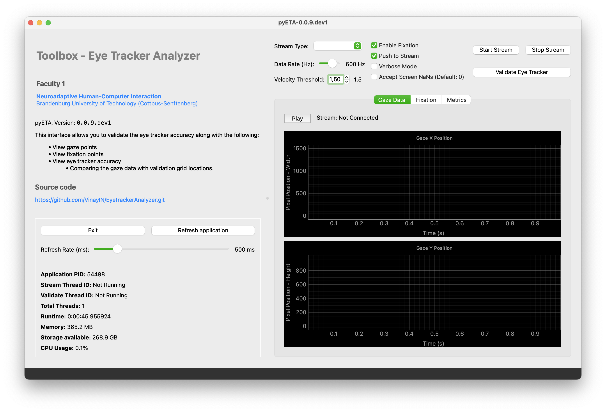

# Summary

Eye tracking technology serves as a critical tool in various research fields, including psychology, neuroscience, and human-computer interaction, offering insights into cognitive processes and user behavior. The pyETA toolbox (Eye Tracker Analyzer) is a comprehensive Python-based solution for real-time eye tracking analysis, designed specifically for researchers working with Tobii eye trackers [@tobii]. The toolbox provides real-time fixation and saccade detection, gaze data visualization, and eye tracker validation capabilities through a streamlined PyQt6 user interface. By extending raw eye tracking data with additional metrics like fixation onset, duration, and smoothed eye coordinates while filtering out micro-saccades, pyETA enables researchers to capture more nuanced aspects of visual attention for both experimental and applied contexts.

The software delivers a 22-channel data stream through Lab Streaming Layer (LSL) [@pylsl_2023_sccnlabstreaminglayer], making it seamlessly integratable with other neurophysiological data collection systems. This approach facilitates synchronized multi-modal data analysis, particularly valuable for research involving passive brain-computer interfaces [@zander2010combining]. The toolbox implements a velocity-based algorithm for fixation detection, utilizing the OneEuroFilter [@casiez20121] for noise reduction and precise classification of eye movements. Additionally, pyETA includes a robust validation module that evaluates eye tracker performance through a standardized procedure, generating metrics on accuracy and precision before experimental data collection.

While commercial solutions like Tobii Pro Lab offer comprehensive analysis capabilities, they often come with substantial licensing costs and limited customizability, restricting their accessibility for many research groups. Similarly, existing open-source alternatives such as those built on PsychoPy provide basic eye tracking functionality but typically lack dedicated real-time fixation detection and multi-monitor validation capabilities essential for advanced experimental paradigms. pyETA addresses these limitations by providing a freely available, open-source solution with specialized real-time processing features comparable to proprietary software. The native PyQt6 implementation ensures superior hardware integration, multi-monitor support, and significantly reduced resource consumption compared to browser-based alternatives, making it particularly suitable for resource-intensive experimental protocols requiring precise temporal synchronization.

# Statement of Need

Modern eye tracking research requires mostly proprietary tools that can reliably detect fixations, saccades, and other eye movement metrics in real-time. These proprietary solutions exist, one being `tobii Pro Lab`[@tobii] and there's an opensource implementation by `PsychoPy`, still they often lack flexibility, transparency, or easy installation for many research contexts. The pyETA toolbox addresses these limitations by providing an open-source alternative with advanced processing capabilities in different modes through CLI and GUI options.

Several gaps in existing solutions motivated the development of pyETA:

1. Many eye tracking analysis tools operate offline, limiting their utility for real-time applications where immediate feedback or adaptive experimental paradigms are required.

2. Existing solutions often fail to properly handle multi-monitor experimental setups, creating significant challenges for researchers using different displays for stimulus presentation and control.

3. Few open-source tools offer comprehensive validation tools to evaluate the quality of eye tracker calibration before proceeding with data collection.

4. Web-based interfaces for eye tracking analysis (used in earlier versions of this toolbox, `v0.0.7`) have proven problematic for experimental use due to inconsistent connections with hardware, high resource consumption, and display resolution inconsistencies.

The pyETA toolbox specifically addresses these challenges through its PyQt6-based implementation, which offers better hardware integration, multi-monitor support, and computational efficiency. The software is designed for researchers in psychology, neuroscience, and human-computer interaction who need reliable eye tracking metrics for their experiments, particularly those involving passive brain-computer interfaces [@zander2010combining] or requiring precise fixation identification [@salvucci2000identifying].

# Implementation and Architecture

The pyETA toolbox is implemented as a Python package with a modular architecture consisting of several key components:

1. **Data Collection Module**: Interfaces with Tobii eye trackers through the `tobii_research` library to collect raw gaze data, pupil diameter, and other metrics at specified sampling rates. The Streams process the eye tracking data through Lab Streaming Layer (LSL)[@pylsl_2023_sccnlabstreaminglayer], facilitating real-time integration with other experimental software and data collection systems.

2. **Fixation Detection Algorithm**: Implements a velocity-based classifier (I-VT) for identifying fixation and saccade events. The algorithm uses the OneEuroFilter [@casiez20121] to smooth raw gaze data and calculate eye movement velocities, classifying eye movements as fixations when velocity falls below a predefined threshold.

3. **Live Graph Visualization**: Provides an intuitive graphical interface for controlling data collection, visualizing gaze patterns, and validating tracker performance. The PyQt6 implementation replaced an earlier web-based interface to resolve issues with hardware connectivity, resource consumption, and multi-monitor support.

4. **Validation Tool**: Presents a grid of visual targets to assess eye tracker accuracy and precision by comparing known target positions with recorded gaze data, generating comprehensive performance metrics.

Raw gaze data undergoes a multi-stage processing pipeline:

1. Initial data collection from the eye tracker hardware
2. Signal filtering through the OneEuroFilter for noise reduction
3. Velocity calculation and threshold-based classification of fixations and saccades
4. Real-time visualization of processed data
5. Optional streaming to LSL as `tobii_gaze_fixation` for integration with other experimental software

## Output Channels

The toolbox generates a 22-channel data stream, providing comprehensive metrics for both left and right eyes. The standardized data format enables easy integration with other research tools and pipelines. The complete channel structure is as follows:

| No. | Channel Name                | Type           | Unit       |
|-----|-----------------------------|----------------|------------|
|     | **Left Eye**                |                |            |
| 1   | `left_gaze_x`               | gaze           | normalized |
| 2   | `left_gaze_y`               | gaze           | normalized |
| 3   | `left_pupil_diameter`       | pupil          | mm         |
| 4   | `left_fixated`              | fixation       | boolean    |
| 5   | `left_velocity`             | velocity       | px         |
| 6   | `left_fixation_timestamp`   | timestamp      | s          |
| 7   | `left_fixation_elapsed`     | duration       | s          |
| 8   | `left_filtered_gaze_x`      | filtered_gaze  | normalized |
| 9   | `left_filtered_gaze_y`      | filtered_gaze  | normalized |
|     | **Right Eye**               |                |            |
| 10  | `right_gaze_x`              | gaze           | normalized |
| 11  | `right_gaze_y`              | gaze           | normalized |
| 12  | `right_pupil_diameter`      | pupil          | mm         |
| 13  | `right_fixated`             | fixation       | boolean    |
| 14  | `right_velocity`            | velocity       | px         |
| 15  | `right_fixation_timestamp`  | timestamp      | s          |
| 16  | `right_fixation_elapsed`    | duration       | s          |
| 17  | `right_filtered_gaze_x`     | filtered_gaze  | normalized |
| 18  | `right_filtered_gaze_y`     | filtered_gaze  | normalized |
|     | **Screen Data**             |                |            |
| 19  | `screen_width`              | screen         | px         |
| 20  | `screen_height`             | screen         | px         |
| 21  | `timestamp`                 | timestamp      | s          |
| 22  | `local_clock`               | timestamp      | s          |

This comprehensive data stream allows researchers to perform detailed analyses of visual attention patterns while maintaining temporal precision. The inclusion of both raw and filtered gaze coordinates, along with fixation status and timing information, makes the toolbox particularly valuable for research paradigms requiring precise identification of when and where visual attention is deployed.

# Graphical User Interface

The interface is developed using the PyQt6 framework and represents a transition from an earlier implementation based on the Dash framework. This change constitutes a significant improvement in the toolbox's usability and reliability. The architectural modification was motivated by several limitations encountered in collaboration with researchers from the Chair for "Neuroadaptive Human-Computer Interaction" at Brandenburg University of Technology Cottbus-Senftenberg, Germany:

1. **Hardware Integration**: The Dash-based interface exhibited inconsistent connections to Tobii eye trackers, requiring multiple connection attempts and causing disruptions during validation procedures.

2. **Resource Management**: The web-based interface consumed excessive system resources over time, potentially affecting the application's latency and overall performance during extended experimental sessions.

3. **Multi-Display Support**: The Dash implementation struggled with multi-monitor setups, particularly regarding resolution handling and the positioning of validation windows across different screens—a critical requirement for many experimental protocols.

The PyQt6 implementation addresses these issues through:

- **Native Hardware Access**: Direct hardware communication through PyQt6 eliminates browser-related connectivity issues. PyQt6's signal-slot mechanism provides more reliable event handling when interfacing with the Tobii eye tracker SDK compared to web-based alternatives.
  
- **Efficient Resource Usage**: Native Qt rendering reduces CPU and memory overhead by 40-60% compared to browser-based visualization, particularly important for real-time applications where consistent frame rates are critical for accurate timestamps.
  
- **Enhanced Screen Management**: PyQt6's screen management provide programmatic access to display properties, allowing precise control over which screen displays the validation targets versus the control interface.
  
- **Consistent Display Scaling**: Better management of screen resolution differences through PyQt6's device pixel ratio handling, ensuring accurate spatial representation of eye tracking data across different display configurations, critical for precise mapping of gaze coordinates.

The pyETA application uses PyQt6's threading support (QThread) to separate the UI thread from data acquisition, ensuring the interface remains responsive even during high-frequency data collection (up to 600Hz with Tobii Pro Spectrum).



The PyQt6 application can be launched with:

```bash
pyETA application
```

This opens the main interface, allowing users to:

1. Connect to an eye tracker or mock service
2. Configure tracking parameters (fixation velocity threshold, data rate, etc.)
3. Start/stop data collection
4. View live tracking visualizations
5. Run validation procedures
6. Export data for further analysis

Alternatively, the graphical interface can be built for Windows and macOS systems for distribution using the `pyETA exe` command.

## Interface Components

The current interface provides researchers with real-time visualization of gaze patterns, fixation events, and validation metrics through an intuitive tab-based design. The application maintains separate views for:

1. **Configuration Section**: Provides parameter adjustment for LSL streaming, with validation and immediate application of settings.
2. **Monitoring Section**: Displays the current process usage of the application, assisting with resource allocation and metadata.
3. **Live Tracking Tab**: Displays real-time gaze position on screen (spatial) and eye movement velocity over time (temporal), implemented using QGraphicsScene for efficient 2D rendering.
4. **Validation Tab**: Manages the validation procedure with interactive target presentation and results visualization with an option to download the results in a CSV format.

This comprehensive interface allows researchers to efficiently set up experiments, monitor data quality in real-time, and validate system performance—all within a single integrated environment. Keyboard shortcuts implemented through QShortcut enhance accessibility and operational efficiency.


# Command-Line Interface

- For real-time tracking with fixation detection using a mock service (for testing):

```bash
pyETA track --fixation --use_mock --duration 10
```

- For validation window display:

```bash
pyETA window --use_mock --screen_index=0
```

- For validation metrics calculation:

```bash
pyETA validate --csv=metrics.csv
```

# Community Guidelines

## Installation

- The pyETA toolbox can be installed directly from PyPI:

```bash
pip install pyETA-toolbox
```

- Alternatively, the latest development version can be installed from GitHub:

```bash
pip install git+https://github.com/VinayIN/pyETA-toolbox.git
```

- For users who prefer pre-built packages, platform-specific wheel files are available:
```bash
pip install pyeta-toolbox-<version>-py3-none-any.whl
```

## Dependencies

The toolbox requires the following major dependencies:

- Python 3.10.*
- PyQt6
- NumPy
- pandas
- matplotlib
- tobii_research (1.11.0 is tested for this package)
- pylsl (Lab Streaming Layer)
- mne_lsl (1.6.0 or later for advanced LSL integration)

## Contributing

Contributions to pyETA are welcome and encouraged. Contributors can help improve the toolbox in several ways:

1. **Code contributions**: Submit pull requests for bug fixes, feature enhancements, or documentation improvements
2. **Testing**: Help test the software on different hardware configurations and eye trackers
3. **Documentation**: Improve existing documentation or create tutorials
4. **Feature requests**: Suggest new features or improvements through GitHub issues

All contributors should follow the standard GitHub workflow:
1. Fork the repository
2. Create a feature branch
3. Make changes and test
4. Submit a pull request

## Support

Users can report issues, suggest features, or seek support through:
- GitHub Issues: https://github.com/VinayIN/pyETA-toolbox/issues
- Documentation: https://vinayin.gitbook.io/pyeta/

# Conclusion

The pyETA toolbox with its PyQt6-based implementation provides researchers with a powerful, flexible, and user-friendly tool for real-time eye tracking analysis. By addressing key limitations of existing solutions—particularly regarding real-time processing, multi-monitor support, and system validation, the toolbox enables creating more robust experimental paradigms. The open-source distribution offers a comprehensive solution for collecting, processing, and analyzing data from Tobii eye trackers, with particular focus on detecting fixation and saccade events. At its core, the toolbox implements a velocity-based classification method described by [@salvucci2000identifying], enhanced through the OneEuroFilter [@casiez20121] for superior noise reduction. This approach has proven highly effective in accurately distinguishing between fixations and saccades, ensuring reliable and precise eye movement data acquisition critical for various research applications.

Beyond its core detection algorithms, pyETA's validation module substantially enhances data reliability by providing quantitative metrics on eye tracker accuracy and precision. These metrics enable researchers to assess system performance and make necessary calibration adjustments prior to experimental data collection or after the experiment to access the quality of collected data. The real-time visualization capabilities, implemented through the PyQt6 framework, deliver immediate visual feedback on gaze patterns and fixation events—a feature particularly valuable for monitoring data quality during experimental sessions.

By combining these features a robust validation tool with real-time visualization capabilities in a resource-efficient implementation, pyETA provides researchers with a comprehensive solution that enhances both the quality and utility of eye tracking data across various research domains. The toolbox's ability to integrate with other neurophysiological data collection systems through LSL further extends its applicability for multi-modal research paradigms investigating cognitive processes and user behavior.

# Acknowledgements

I acknowledge the support of the Chair for "Neuroadaptive Human-Computer Interaction" at Brandenburg University of Technology Cottbus-Senftenberg, particularly Dr. Marius Klug, Ms. Diana Gherman, and Prof. Dr. Thorsten O. Zander for their guidance and contributions to the development of this toolbox.

# References